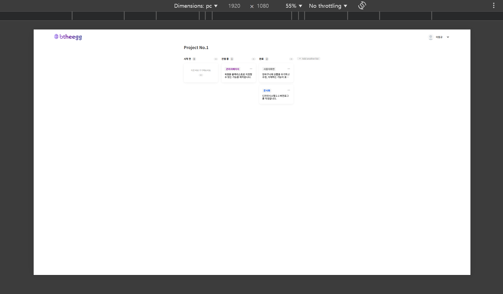

# 📌 프로젝트 제목

### Kanban Board (React 기반 칸반 보드 애플리케이션)

<br/>

## 📋 프로젝트 개요
<p>
이 프로젝트는 React를 사용하여 구현한 칸반 보드 애플리케이션입니다.
</p>
<p>
사용자는 프로젝트 제목을 수정하고, 컬럼과 카드를 추가, 삭제, 수정할 수 있으며, 드래그 앤 드롭을 활용하여 카드의 위치를 변경할 수 있습니다.
</p>

<br/>

## 🏗 프로젝트 실행 방법
**1. 프로젝트 클론**
   ```sh
   git clone https://github.com/LDK1009/Btheegg-KanbanBoard.git
   ```
   ```sh
   cd ./project
   ```
**2. 패키지 설치**
   ```sh
   npm install
   ```
**3. 개발 서버 실행**
   ```sh
   npm run dev
   ```

<br/>


## 📂 폴더 구조
```
src/  
│── 📁 assets/         # 🖼️ 정적 파일
│── 📁 components/     # 📦 UI 컴포넌트  
│── 📁 pages/          # 📄 페이지 컴포넌트
│── 📁 store/          # 🗄️ 상태 관리  
│── 📁 styles/         # 🎨 전역 스타일 및 테마 파일  
│── 📁 types/          # 📝 TypeScript 타입 및 인터페이스 정의  
│── 📄 App.tsx         # 🏠 최상위 React 컴포넌트 (라우팅 및 상태 관리 포함)  
│── 📄 main.tsx        # 🚀 애플리케이션 진입점 (React DOM 렌더링) 
```

<br/>

## 🛠 기술 스택

**📦 라이브러리**

React (18.3.1)

React DOM (18.3.1)

<br/>

**💄 스타일링**

MUI (6.4.3)

Styled Components (6.1.14)

<br/>

**🎯 상태 관리**

Zustand (5.0.3)

<br/>

**🎮 드래그 & 드롭**

React DnD (16.0.1)

<br/>

## 🚀 주요 기능

### ✅ 기본 기능
**1. 프로젝트 제목 수정**

   
<br/>

**2. 컬럼 추가 및 삭제**

<p>
2.1 컬럼 추가


</p>

<br/>

<p>
2.2 컬럼 삭제(컬럼 헤더 영역 우클릭)

</p>

<br/>

<p>
2.3 기본 컬럼 삭제 불가

</p>

<br/>

**3. 카드 추가 및 수정, 삭제**

<p>
   3.1 카드 추가
   
</p>
   
<p>
   3.2 카드 수정, 삭제
   
</p>

<br/>

**4. 카드 이동**

4.1 드래그 앤 드롭을 활용한 컬럼 간 이동


<br/>

**5. 상태 저장**
5.1 Zustand 라이브러리를 활용한 상태저장


<br/>

**6. 반응형 디자인 지원**

<p>
   6.1 PC, 노트북, 태블릿 환경 반응형 레이아웃 적용
   
   
   
</p>

<br/>

### 🔥 추가 기능 (선택사항 구현 부분)
**1. 태그 관리**

<p>
   1.1 카드에 태그를 추가 및 삭제 가능, 태그 색상 지정 가능
   
</p>

<br/>

**2. 애니메이션 효과**

<p>
   드래그 시 부드러운 이동 효과, 카드 추가/삭제 시 애니메이션 효과
   <video controls src="README-ASSET/btheegg-KanbanBoard - Chrome 2025-02-08 22-15-38.mp4" title="Title"></video>
</p>

<br/>

**3. 배포**
<p>
   프로젝트를 배포하여 실제 사용 가능한 상태로 제공

   [](https://btheegg-kanban-board-i84oa5er1-dong-kyu-lees-projects.vercel.app/)   

   배포 링크 : https://btheegg-kanban-board-i84oa5er1-dong-kyu-lees-projects.vercel.app/

   [바로가기](https://btheegg-kanban-board-i84oa5er1-dong-kyu-lees-projects.vercel.app/)
</p>